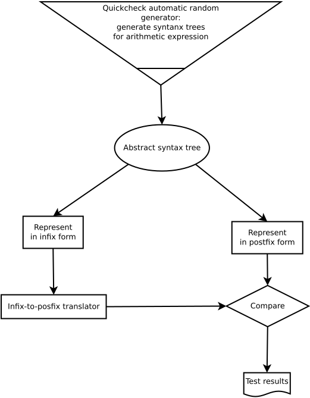
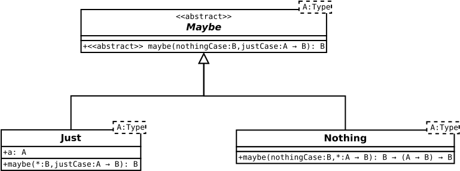
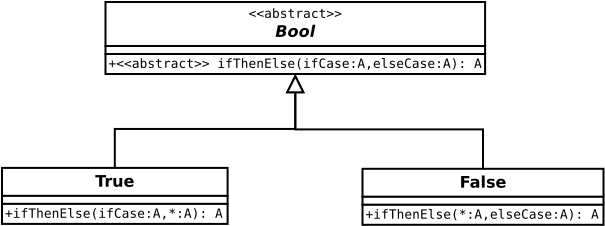

# Using patterns from functional programming for refactoring traditional codebases

The task is to write a simple program, which converts basic arithmetic formulas (of the familiar infix notation) into the reversed Polish notation (postfix notation, well known to i.e. Forth programmers, experts of PostScripts, rememberers of Hewlett-Packard calculators).

For simplicity's sake, let the numbers be simple integers between 0 and 9 (i.e. 1-digit numbers).

The sorcecode of the task can be regarded as an obfuscated version of an algorithm based on using two stacks (LIFOs). Furthermore, the obfuscated implementation seems to be having its core originally written in a declarative, functional programming style, mixed with imperative usage of closures.

Thus, the task is essentially finding this pure core behind the obfuscation. This can be done by using standard refactory steps (factoring out into independent function, establishing standalone algebraic types etc.).

This page will take a round trip. First we will show first a pure functional solution, written in Haskell. Besides undoing the obfuscation by refactory, also the imperative parts of the code will be rewritten by their purely declaritive counterparts, mostly by finding apropriate algebraic data types for the problem space. We can represent the idiomatic part of the algorithm into a “two-stack-interaction” data structure (called “`PostfixContext`” in the following sourcecode samples).

After having shown the pure Haskell solution, we will return back to JavaScript: a Node.js implemementation will be shown. Imperative technique will be allowed here in a more relaxed, less orthodox manner, especially those that can be justified by the pecularities of the inherent features of the JavaScipt language itself (allowing in-place array modification instead of immutable structures). Thus, it will not be a direct mirror of the Haskell version, but still, we will try to keep the spirit of modularity, code reuse, lazy coupling of the pure solution.

## The Haskell version

The Haskell implementation can be rather compact, while maintaining also modularity, reuse and lazy coupling.
The sourcecode is accompanied also by Hspec and QuickCheck test cases.

Let us begin with the Hspec test scenario: it contains a kind of specification of the task itself. It can be found in the [`Translator.hs`](haskell+quickcheck/Translator.hs) file:

```haskell
import Test.Hspec

translateSpec :: Spec
translateSpec = describe "The main function of the task: translate" $ do
    it "keeps simple digit symbols like simpleArgument" $ do
        translate ""        `shouldBe` ""
        translate "1"       `shouldBe` "1"
        translate "12"      `shouldBe` "12"
        translate "123"     `shouldBe` "123"
    it "processes a simple infix construct like postfix" $ do
        translate "1+2"     `shouldBe` "12+"
        translate "2*3"     `shouldBe` "23*"
    it "handles precedences and parantheses well" $ do
        translate "2*3+1"   `shouldBe` "23*1+"
        translate "1+2*3"   `shouldBe` "123*+"
        translate "1*(2+3)" `shouldBe` "123+*
```

Although intuitively this seems to be a sufficient coverage for the specification of the problem, the so-called *property testing* often provides more thorough testing, because random generation provides hundreds of samples for free. Of course, that comes for a price, but this is infact rather an advantage rather than a disadvantage: property testing motivates the programmer towards grasping core properties on a higher level, and a good unserstanding of the very algebra of the problem.

Here, QuickCheck will be used for this property testing tool, but the more important question is how we can grasp the task and generalize in into algebraic properties. It can be done indeed: let us discover a kind of $\vec V$-shape pattern:

```haskell
import Test.QuickCheck

prop_translate :: SimpleArithmetic -> Bool
prop_translate abstractSyntaxTree = translate (showAsInfix abstractSyntaxTree) == showAsPostfix abstractSyntaxTree
```

By $\vec V$-shaped pattern of testing, I mean that we can find a “common” representation “above”/“above” the infix notation and postfix notation: the *abstract syntax tree*. It can be regarded as a “notation-agnostic”, “common” representation:

```haskell
data Digit = Dgt Int

data SimpleArithmetic = Simple Digit
                      | Add       SimpleArithmetic SimpleArithmetic
                      | Substract SimpleArithmetic SimpleArithmetic
                      | Multiply  SimpleArithmetic SimpleArithmetic
                      | Divide    SimpleArithmetic SimpleArithmetic
```

See it in [`CommonAbstractSyntaxTree.hs`](haskell+quickcheck/CommonAbstractSyntaxTree.hs) file.
This is indeed a common, notation-agnostic representation: turning it into postfix form is that easy:

```haskell
showsAsPostfix :: SimpleArithmetic -> ShowS
showsAsPostfix (Simple d     ) = showsDigit d
showsAsPostfix (Add       a b) = showsAsPostfix a . showsAsPostfix b . (:) '+'
showsAsPostfix (Substract a b) = showsAsPostfix a . showsAsPostfix b . (:) '-'
showsAsPostfix (Multiply  a b) = showsAsPostfix a . showsAsPostfix b . (:) '*'
showsAsPostfix (Divide    a b) = showsAsPostfix a . showsAsPostfix b . (:) '/'
```
Turning it into the familiary infix form is harder due to additional notational rules like precendence rules and parantheses, but it is not extremely difficult either, see `showsAsInfix` in the same file.

To put the pieces together:

 - simply generate random syntax trees of arithmetic expession, a lot by hundreds (“the bottom point of the $\vec V$”),
 - and turn it into representations, both in infix and in postfix form (“the two legs/wings/branches of the $\vec V$”).
 - Use the infix form as an input of the `translate` function (“the over-arrow symbol above the $\vec V$”)
 - and check whether the result is the same as the postix form.



QuickCheck is thus a very strong tool for testig, by making the random generation of instances of any custom datatype easily automatizable:

```haskell
import Test.QuickCheck

instance Arbitrary Digit where
    arbitrary = Dgt <$> elements [0..9]

instance Arbitrary SimpleArithmetic where
    arbitrary = sized genSizedArithmetic

genSizedArithmetic :: Int -> Gen SimpleArithmetic
genSizedArithmetic 0 = Simple <$> arbitrary
genSizedArithmetic n = oneof [genSizedArithmetic 0, Add <$> genSubsizedArithmetic n <*> genSubsizedArithmetic n, Substract <$> genSubsizedArithmetic n <*> genSubsizedArithmetic n, Multiply <$> genSubsizedArithmetic n <*> genSubsizedArithmetic n, Divide <$> genSubsizedArithmetic n <*> genSubsizedArithmetic n]
genSubsizedArithmetic = genSizedArithmetic . (`div` 2)
```

After having seen the specification of the task by the tests, let us see the solution, the implemented algorithm itself!

The highest-level part of the solution can be seen in [`Translator.hs`](haskell+quickcheck/Translator.hs) file:

```haskell
translate :: String -> String
translate = bendBack . foldl (flip processCurrentSymbol) initialPostfixContext
```

Thus, we have kept the main scheme of the original code obfuscation: the “*array-fold/reduce*” construct. But we have cleaned it up: we “factored out” the imperative closures than hang around this main core like rags, and integrated this imperative parts into the traversed structure itself: we augmented the traversed array into a contexted algebraic structure consisting of two stacks.

This is exactly what the [`PostfixContext.hs`](haskell+quickcheck/PostfixContext.hs) file is about:

```haskell
type PostfixContext = (String, String) -- argumentsExpression, postfixStack

precedences :: [(Char, Int)]
precedences = [('+', 1), ('-', 1), ('*', 2), ('/', 2)]

processCurrentSymbol :: Char -> PostfixContext -> PostfixContext
processCurrentSymbol currentSymbol context
    | isDigit currentSymbol               = simpleArgument              currentSymbol context
    | currentSymbol == '('                = stackAsPostfixOperator      currentSymbol context
    | currentSymbol == ')'                = flushParenthesizedOperators               context
    | otherwise                           = case currentSymbol `lookup` precedences of
                                                Just precVal -> flushHigherPrecedenceOperators currentSymbol precVal context
                                                Nothing      -> error $ "Invalid character " ++ [currentSymbol]
```

This fits indeed into the array reduce/fold main scheme of the task.
as we can see, this reducer algorithm itself consists of case analysis, and delgates its task onto smaller case delegate functions. The details can be read further below in the `PostFixContext` module file.

Why we have dissected even this main reducer function into stadalone cases and a separate delegate case function for each case?
Better unit testability, and maybe also a prospect for future generalization and potential discovery interesting or deeper algebraic properties.

## The Node.js version

The same idea can be expressed also in the JavaScript (nodejs) version, although we will keep some parts imperative, due to the different optimization strategies of the two compilers/interpreters.

Although here there is no QuickCheck test, but we can still write a test-incorporated specification of the task: providing input-vs-expectation pairs for the translating the familiar, school-style formalism of arithmetic expression into the reversed Polish notation (postfix form, well known to Forth programers). This can be read most clearly out of the tester file: infix-to-postfix translation specification can be found in the [`main-test.mjs`](nodejs/main-test.mjs) file:

```javascript
rawTextToPostfixNotation(''       ) == ''     ,
rawTextToPostfixNotation('1'      ) == '1'    ,
rawTextToPostfixNotation('12'     ) == '12'   ,
rawTextToPostfixNotation('1+2'    ) == '12+'  ,
rawTextToPostfixNotation('2*3+1'  ) == '23*1+',
rawTextToPostfixNotation('1+2*3'  ) == '123*+',
rawTextToPostfixNotation('1*(2+3)') == '123+*',
```

We can see from the last example, that the reverse Polish notation can evade the usage of parentheses.
This suggests that the solution is based on some kind of stack/FIFO structures. Indeed, for implementation, we will use an auxiliary stack.

First, let us see a general scheme of he solution: it can be found in the [`domain-logic/postfix-notation-translator.mjs`](nodejs/domain-logic/postfix-notation-translator.mjs) file:

```javascript
const expressionToPostfixNotation = inputExpression =>
        inputExpression.reduce(
            (context, currentSymbol) => {context.processCurrentSymbol(currentSymbol); return context;},
            new PostfixContext([], [])
        ).bendBack();
```

This translates an array of single-letter symbols (1-digit numbers and arithmetic operator signs) from the  familiar infix notation into the reversed Polish notation. See its test cases in [`test.mjs`](test.mjs):

```javascript
expressionToPostfixNotation([             ]).equals([             ]),
expressionToPostfixNotation(['1'          ]).equals(['1'          ]),
expressionToPostfixNotation(['1', '2'     ]).equals(['1', '2'     ]),
expressionToPostfixNotation(['1', '+', '2']).equals(['1', '2', '+']),
```

If almost the same, as the earlier mentioned final solution, i.e. the `rawTextToPostfixNotation` function: we simply we wrap a lexer around `expressionToPostfixNotation`, and we get exactly the final `rawTextToPostfixNotation`. Wrapping a lexer around is easy with higher-order function and currying:

```javascript
const wrapLexerAround =  // Def with currying
    expressionProcessor =>
        rawInputText => expressionProcessor(rawInputText.split('')).
            join('');

const expressionToPostfixNotation = inputExpression =>
        inputExpression.reduce(
            (context, currentSymbol) => {context.processCurrentSymbol(currentSymbol); return context;},
            new PostfixContext([], [])
        ).bendBack();

const rawTextToPostfixNotation = wrapLexerAround(expressionToPostfixNotation); // Currying used
```

as we can see in the definitions defined in the [`domain-logic/postfix-notation-translator.mjs`](nodejs/domain-logic/postfix-notation-translator.mjs) file.

## A purely functional, declarative shell around imperative details

Our solution till now can be seen like refactoring into an almost purely Haskell-spirited decarative paradigm. we could have written almost the same functions in Haskell with lists and the `foldr` catamorphism of the lists, the exact incarnation of array reduce:

**Implementation**:

```javasscript
const expressionToPostfixNotation = inputExpression =>
        inputExpression.reduce(
            (context, currentSymbol) => {context.processCurrentSymbol(currentSymbol); return context;},
            new PostfixContext([], [])
        ).bendBack();
```

**Behavior**:

```javascript
expressionToPostfixNotation([             ]).equals([             ]),
expressionToPostfixNotation(['1'          ]).equals(['1'          ]),
expressionToPostfixNotation(['1', '2'     ]).equals(['1', '2'     ]),
expressionToPostfixNotation(['1', '+', '2']).equals(['1', '2', '+']),
```

The details behind this simple foldr/reduce-style solution can be found in [`domain-logic/PostfixContext.mjs`](nodejs/domain-logic/PostfixContext.mjs):

```javascript
function PostfixContext(argumentsExpression, postfixStack)
{
    this.argumentsExpression = argumentsExpression;
    this.postfixStack        = postfixStack;
}

PostfixContext.arithmeticPrecedences = {'+': 1, '-': 1, '*': 2, '/': 2};

// The main, central instance method:

PostfixContext.prototype.processCurrentSymbol = function (currentSymbol)
{
    const precs = PostfixContext.arithmeticPrecedences;
    switch (true) {
        case /[0-9]/.test(currentSymbol): this.simpleArgument                 (currentSymbol); break;
        case currentSymbol in precs     : this.flushHigherPrecendenceOperators(currentSymbol); break;
        case currentSymbol == '('       : this.stackAsPostfixOperator         (currentSymbol); break;
        case currentSymbol == ')'       : this.flushParenthesizedOperators    (currentSymbol); break;
    }
};
```

The further details, i.e. the delegate case methods of the main method of this file can be  can be found below all these in the same file.

Some auxiliary datatypes are also used. they can be found in:

- [`algebraic-datatypes/ArrayExt.mjs`](nodejs/algebraic-datatypes/ArrayExt.mjs)
- [`algebraic-datatypes/MaybeExt.mjs`](nodejs/algebraic-datatypes/MaybeExt.mjs), which contains a Scala-inspired style implementation of the famous `Option` type (in Haskell: `Maybe`), the functional programming solution for evading the null-value problems (making partial functions total). The Scala-inspired implementation details (“*case objects*”) are contained in a subfolder of its own:
    - [`algebraic-datatypes/MaybeExt/Maybe.mjs`](nodejs/algebraic-datatypes/MaybeExt/Maybe.mjs), an abstract class
    - [`algebraic-datatypes/MaybeExt/Maybe_Just.mjs`](nodejs/algebraic-datatypes/MaybeExt/Maybe_Just.mjs), a child class concretization for the existing value case
    - [`algebraic-datatypes/MaybeExt/Maybe_Nothing.mjs`](nodejs/algebraic-datatypes/MaybeExt/Maybe_Nothing.mjs), a child class concretization for the missing value case

This is the standard solution of implementing an [algebraic datatype](https://en.wikipedia.org/wiki/Algebraic_data_type) in an imperative language, using OOP inheritance to simulate that.



The trick's main idea was first used in Self and Smalltalk to implement Bool, and later generalized in Scala for arbitrary algebraic datatypes: an arbitrary structure composed of algebraic direct products and direct sums (sort of records and tagged unions).


